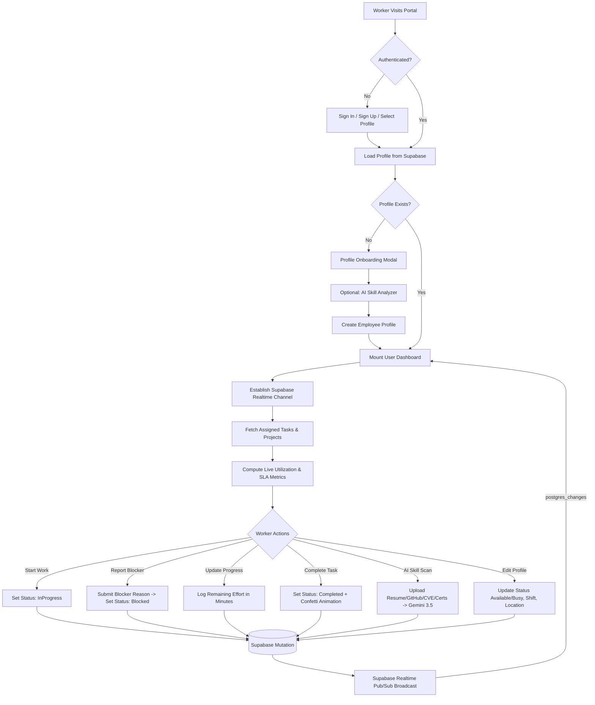

# AI-Powered Intelligent Task Allocation – User Side

The **User-Side Web Application** is the dedicated worker- and engineer-facing interface for the **AI-Powered Intelligent Task Allocation and Resource Optimization System**.

While administrative governance and allocation dispatch engines operate on the management side, this portal provides individual engineers and workers with a real-time workstation to view their assigned work orders, monitor dynamic SLA deadlines, track capacity and workload utilization, update task execution status, report blockers with reallocation requests, and analyze their technical skill proficiencies using Gemini 3.5 AI.

The application connects directly to a **Supabase PostgreSQL** backend using **Supabase Realtime WebSockets** (`postgres_changes`) as the single source of truth, ensuring instant zero-refresh synchronization between workers and project dispatchers.

- **Live Production URL**: [https://nexus-workforce-user.vercel.app](https://nexus-workforce-user.vercel.app)
- **GitHub Repository**: [https://github.com/rajeshadhi2006-man/CODE-GEN-.git](https://github.com/rajeshadhi2006-man/CODE-GEN-.git)
- **Dedicated Branch**: [`user-portal`](https://github.com/rajeshadhi2006-man/CODE-GEN-/tree/user-portal)

---

# 1. Overview

- **What it is**: A high-density, real-time single-page web portal built with React 19, TypeScript, Vite, and Vanilla CSS glassmorphic design tokens.
- **Who uses it**: Assigned software engineers, devops specialists, security analysts, and workforce contributors.
- **What users can do**:
  - Authenticate securely via Supabase Auth or connect through existing verified employee profiles.
  - View all assigned tasks ordered by SLA deadlines.
  - Transition task lifecycle states (`Ready` → `InProgress` → `Completed`).
  - Report blockers and request automated AI-driven task reallocation with reasoning.
  - Log and update remaining effort in minutes to keep organization-wide capacity models accurate.
  - Monitor live SLA countdown timers with warning thresholds (breach alerts and urgent warnings).
  - Review workload capacity metrics and utilization percentages.
  - Inspect notifications containing AI task reallocation proposals and system audit records.
  - Update their operational status (`Available`, `Busy`, `Unavailable`), working location, and shift hours.
  - Ingest multi-asset credentials (resumes, GitHub repositories, CVE disclosures, and certifications) for autonomous skill extraction powered by Google Gemini 3.5 AI.
- **How it connects**: Connects to the Supabase backend via `@supabase/supabase-js` using standard REST endpoints and persistent WebSocket subscriptions (`postgres_changes`) for real-time pub/sub synchronization.
- **How it helps users manage assigned work**: Removes uncertainty by displaying clear business impact scores, client context, dependency states, remaining effort, and exact time left before SLA breach.

---

# 2. User-Side Features

### Authentication & Session Management
- **Sign In**: Email and password authentication verified via `supabase.auth.signInWithPassword`.
- **Sign Up**: Account creation via `supabase.auth.signUp` collecting name, title, geographic region (`Americas`, `EMEA`, `APAC`, `LATAM`, `South Asia`), and location.
- **Password Reset**: Automated password recovery flow via `supabase.auth.resetPasswordForEmail`.
- **Session Persistence**: Sessions persist in `localStorage` with automatic token refresh handled by `@supabase/supabase-js`.
- **Quick Profile Selection**: Onboarding and development helper allowing quick connection to existing database employee records (`public.employees`).
- **Initial Profile Onboarding**: Automatically detects if an authenticated user lacks an employee profile record and prompts them to initialize one.

### User Dashboard & Telemetry Metrics
The dashboard presents a clean, glassmorphic operational header and dynamic telemetry cards computed directly from active task and profile records:
- **Total Assigned Tasks**: Total count of all tasks assigned to the current employee in Supabase.
- **In Progress Tasks**: Count of tasks currently in execution (`status === 'InProgress'`).
- **Completed Tasks**: Total tasks marked complete (`status === 'Completed'`).
- **Effective Workload Utilization (%)**: Dynamically computed as:
  $$\text{Utilization \%} = \min\left(100, \text{round}\left(\frac{\sum \text{remaining\_effort\_min}}{\text{capacity\_hours} \times 60} \times 100\right)\right)$$
- **SLA Risk Counter**: Highlights tasks where deadline is less than 60 minutes away or remaining effort exceeds the available time buffer.
- **Realtime Status Badge**: Indicates live Supabase WebSocket connection (`Supabase Realtime Live` with emerald pulse) with manual click-to-sync capability.

### Task Management
Workers interact directly with their delivery queue through dedicated task cards:
- **Task Identity**: Displays task code (e.g., `TSK-FE-101`), task title, and associated client project name, client tier, and health.
- **Dynamic SLA Countdown**: Live timer displaying remaining time before deadline.
  - *SLA Met*: Rendered in green when completed.
  - *Breached*: Rendered in red with warning icon if deadline has passed.
  - *Urgent*: Rendered in amber if less than 60 minutes remain.
  - *Healthy*: Standard countdown formatted in hours and minutes.
- **Priority Badges**: Visual indicator representing `Critical`, `High`, `Medium`, or `Low` priority.
- **Business Impact Score**: Progress meter reflecting business importance (0–100 scale).
- **Task Actions**:
  - **Start Work**: Transitions task from `Ready` to `InProgress`.
  - **Mark Completed**: Transitions task to `Completed`, zeroes remaining effort, and triggers a celebration confetti animation.
  - **Report Blocker / Request Reallocation**: Opens a modal to submit a blocker reason; sets task status to `Blocked` and registers an audit log request in Supabase for dispatcher intervention.
  - **Log Remaining Effort**: Opens a modal allowing the worker to update remaining minutes of effort (`remaining_effort_min`), updating real-time organization metrics.
- **Filtering & Search**:
  - Filter by status tabs: `All`, `Active`, `InProgress`, `Ready`, `Blocked`, `Completed`.
  - Instant text search across task code, task name, and project name.

### User Profile Management
Accessible via the user avatar button in the top navigation bar:
- **Identity Overview**: Displays full name, job title, email, region, timezone, and weekly capacity hours.
- **Operational Status Switcher**: Allows workers to update their current state between `Available`, `Busy`, and `Unavailable`.
- **Location & Shift Editor**: Allows editing physical/remote location and daily shift hours (`shift.start` to `shift.end`), written directly to `public.employees`.
- **Telemetry & Quality Baseline**: Displays historical performance quality score, on-time delivery rate, and 30-day task completion volume.
- **Verified Skills Matrix**: Visual progress bars showing verified technical skill proficiencies mapped to canonical IDs.
- **Certifications**: Displays professional accreditations on record.
- **Verified Past Works Timeline**: Displays past projects, role, impact, technologies used, and accreditation source.

### In-App Notification Drawer
Slide-over drawer opened from the bell icon in the navigation bar with an unread badge:
- **AI Reallocation Proposals**: Real-time notifications from `public.recommendations` notifying workers when the AI resource optimization engine proposes task transfers, showing confidence scores and target status.
- **System Audit Logs**: Real-time events from `public.audit_logs` detailing skill updates, work assignments, and approved changes involving the worker.

### Real-Time WebSocket Synchronization
The application maintains persistent Supabase Realtime subscriptions using `@supabase/supabase-js`:
- **Subscribed Tables**:
  - `public.tasks`: Automatically updates task cards and re-evaluates workload metrics when tasks are assigned, modified, or deleted.
  - `public.employees`: Automatically updates profile information, status, and skills when modified.
  - `public.recommendations`: Streams new AI reallocation proposals to the notification drawer.
  - `public.audit_logs`: Streams assignment and verification events to the notification drawer.
- **Lifecycle & Reconnection**: Employs a single stable channel per worker (`nexus-user-${employeeId}`) with automated graceful reconnection upon network interruptions.

### AI Skill & Past Works Analyzer
Integrated in the onboarding flow, top navigation, and user profile modal:
- **Multi-Source Input Ingestion**:
  1. *Resume / CV*: Upload `.pdf`, `.txt`, `.md`, `.json` or paste raw text.
  2. *GitHub Repository*: Queries public GitHub REST API for language distributions, repository stars, and topics.
  3. *CVE & Security Disclosures*: Extracts `CVE-YYYY-NNNN` vulnerability advisories and security research attributions.
  4. *Certificates*: Extracts verified cloud and DevOps credentials (CKA, AWS, CISSP, OSCP, etc.).
- **Gemini 3.5 AI Extraction**:
  - Communicates with Google Gemini 3.5 AI (`gemini-3.5-flash-lite`) via REST API using `VITE_GEMINI_API_KEY`.
  - Identifies historical achievements (*what the engineer built, scaled, optimized, or fixed*).
  - Maps competencies to canonical Nexus skill definitions (`sk-k8s`, `sk-aws`, `sk-azure`, `sk-db`, `sk-kafka`, `sk-sec`, `sk-tf`, `sk-go`, `sk-python`, `sk-react`, `sk-obs`, etc.).
  - Calculates calibrated proficiency percentages (65%–99%) and baseline quality scores.
- **Interactive Verification**: Sliders enable the worker to review and adjust extracted proficiencies prior to committing.
- **Database Persistence**: Writes verified skills, certifications, and past works directly to `public.employees` and emits a `PORTFOLIO_SKILL_VERIFICATION` audit log to `public.audit_logs`.

---

# 3. User Workflow

The end-to-end user workflow implemented in the application:



---

# 4. Tech Stack & Dependencies

- **Framework**: [React 19](https://react.dev/) (`^19.2.8`)
- **Build Tool**: [Vite 8](https://vite.dev/) (`^8.3.0`) with [@vitejs/plugin-react](https://github.com/vitejs/vite-plugin-react)
- **Language**: [TypeScript](https://www.typescriptlang.org/) (`~6.0.2`)
- **Backend & Database**: [Supabase](https://supabase.com/) (`@supabase/supabase-js ^2.116.0`)
- **AI Model**: [Google Gemini 3.5](https://ai.google.dev/) (`gemini-3.5-flash-lite`) via Google Generative Language API
- **Icons**: [Lucide React](https://lucide.dev/) (`^1.47.0`)
- **Animations & Effects**: [canvas-confetti](https://www.npmjs.com/package/canvas-confetti) (`^1.9.4`)
- **Styling**: Vanilla CSS Design Tokens (Dark Mode, Glassmorphism, Responsive Grid)
- **Linter**: [Oxlint](https://oxc.rs/) (`^1.81.0`)

---

# 5. Project Directory Structure

```
user-portal/
├── public/
│   ├── favicon.svg             # Application brand favicon
│   └── icons.svg               # SVG icons sprite
├── src/
│   ├── assets/                 # Brand illustrations & SVG assets
│   ├── components/
│   │   ├── auth/
│   │   │   └── AuthModal.tsx   # Login, registration, password reset & profile connect
│   │   ├── dashboard/
│   │   │   ├── MetricOverview.tsx # Workload utilization, SLA countdowns & risk counters
│   │   │   └── UserDashboard.tsx  # Main workstation shell with telemetry summary
│   │   ├── layout/
│   │   │   └── Navbar.tsx      # Top bar with Realtime pulse, sync & notification trigger
│   │   ├── notifications/
│   │   │   └── NotificationDrawer.tsx # Real-time drawer for AI recommendations & audit logs
│   │   ├── portfolio/
│   │   │   └── SkillAnalyzerModal.tsx # Gemini 3.5 AI Resume, GitHub, CVE & Certs analyzer
│   │   ├── profile/
│   │   │   ├── ProfileOnboardingModal.tsx # First-time profile initialization modal
│   │   │   └── UserProfileModal.tsx       # Profile editor, shift scheduler & skills matrix
│   │   ├── tasks/
│   │   │   └── UserTasksList.tsx # Assigned tasks queue, blocker submission & effort logger
│   │   └── ui/
│   │       ├── EmptyState.tsx    # Zero-data state display
│   │       ├── ErrorBanner.tsx   # Dismissible error banners
│   │       └── LoadingSkeleton.tsx # Shimmer placeholders for dashboard & tasks
│   ├── context/
│   │   ├── AuthContext.tsx       # Supabase auth session & employee profile state
│   │   └── UserStoreContext.tsx  # Supabase tasks, projects, metrics & realtime socket
│   ├── lib/
│   │   └── supabase.ts           # Supabase client singleton
│   ├── services/
│   │   └── skillAnalyzer.ts      # Gemini 3.5 AI & GitHub API ingestion service
│   ├── types/
│   │   └── database.ts           # TypeScript interfaces matching Supabase schema
│   ├── App.css                   # Component-level utility styles
│   ├── App.tsx                   # Root authentication router & provider tree
│   ├── index.css                 # Global CSS design tokens, glassmorphism & typography
│   └── main.tsx                  # React DOM mount point
├── .env.example                  # Environment variable reference
├── .gitignore                    # Git ignore file (excludes secrets and artifacts)
├── index.html                    # HTML5 entry document with Inter & Outfit fonts
├── package.json                  # Dependencies and run scripts
├── tsconfig.json                 # TypeScript project configuration
├── vercel.json                   # Vercel deployment rewrite rules for SPA routing
└── vite.config.ts                # Vite build configuration
```

---

# 6. Local Setup & Running Instructions

### Prerequisites
- [Node.js](https://nodejs.org/) (version 18 or higher)
- [npm](https://www.npmjs.com/) or [pnpm](https://pnpm.io/)

### 1. Clone the Repository
```bash
git clone https://github.com/rajeshadhi2006-man/CODE-GEN-.git
cd CODE-GEN-
```
If using the standalone branch:
```bash
git checkout user-portal
```
Or if using the monorepo subfolder on `main`:
```bash
cd user-portal
```

### 2. Install Dependencies
```bash
npm install
```

### 3. Configure Environment Variables
Create a `.env` file in the root of the user portal:
```env
VITE_SUPABASE_URL=https://your-project.supabase.co
VITE_SUPABASE_ANON_KEY=your-supabase-anon-key
VITE_GEMINI_API_KEY=your-gemini-api-key
```

### 4. Start Development Server
```bash
npm run dev
```
The application will launch locally at `http://localhost:5173/` (or next available port).

### 5. Production Build
To validate TypeScript types and compile the optimized production bundle:
```bash
npm run build
```
Preview the production build locally:
```bash
npm run preview
```

---

# 7. Deployment

The application is configured with [`vercel.json`](./vercel.json) containing client-side SPA rewrites (`/(.*) -> /index.html`) and is deployed to **Vercel Production**:

- **Production URL**: [https://nexus-workforce-user.vercel.app](https://nexus-workforce-user.vercel.app)
- **Status**: Active & Live (HTTP 200)
