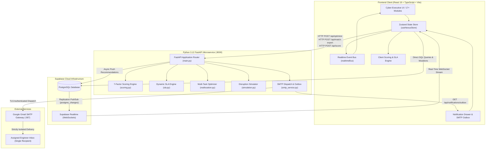

# NEXUS WORKFORCE OS
### Autonomous Multi-Factor Workforce Allocation, Dynamic SLA Risk Engine & Real-Time SMTP Talent Dispatch

---

## 2. Project Overview

**NEXUS WORKFORCE OS** is an autonomous workforce intelligence and resource allocation operating system built for enterprise engineering operations, technical delivery hubs, and global project portfolios.

### What the Project Does
The platform evaluates task demands against workforce capacity in real time. It calculates deterministic multi-factor allocation scores, detects upcoming SLA breaches before they occur, proposes optimal human-in-the-loop reallocations, simulates outage blast radiuses, and automatically dispatches isolated work notifications directly to assigned engineers via SMTP email.

### What Problem It Solves
Modern technology organizations regularly manage more inbound work orders than available engineering headcount. Assigning resources manually creates critical bottlenecks:
- Engineers are frequently assigned based on recency bias rather than genuine skill proficiency.
- Deadlines and SLA buffers degrade invisibly until commitments are breached.
- Sudden developer unavailability (illness, leave, emergencies) causes cascading delivery failures.
- Broad notification blasts create communication noise and privacy risks.

NEXUS solves this by executing continuous mathematical scoring across skills, workload, availability, deadlines, geographic alignment, and historical performance, backed by autonomous recovery planning and targeted direct notifications.

### Who Uses It
- **Super Admins & Executives**: Portfolio health governance, SLA compliance auditing, systemic risk oversight, and global policy weighting.
- **Workforce & Delivery Managers**: Capacity planning, shift load balancing, and human-in-the-loop approval of AI reallocation proposals.
- **Team Leads & Project Managers**: Task creation, dependency management, critical path monitoring, and 1-click real-time expert talent matching.
- **Engineers**: Receive direct, confidential assignment dispatch emails detailing task specs, urgency, SLA deadlines, and matching rationale.

### How the System Works at a High Level
1. **Live State Synchronization**: The system loads live projects, tasks, employees, and audit logs from a **Supabase PostgreSQL** database and maintains continuous bi-directional synchronization via **Supabase Realtime WebSockets** (`postgres_changes`).
2. **Deterministic 7-Factor Scoring**: When tasks enter the delivery queue, a dual-layer allocation engine (client-side TypeScript + Python 3.12 FastAPI microservice) evaluates compatibility across 7 normalized dimensions.
3. **Dynamic SLA Risk Monitoring**: Active timers and historical velocity metrics continuously calculate safety buffers and project breach likelihood into discrete risk tiers.
4. **Autonomous Reallocation & Governance**: When a disruption occurs, the optimizer computes optimal reallocation chains, generates candidate alternatives, and assigns required approval levels (`Auto`, `Manager`, `Executive`).
5. **Targeted SMTP Email Dispatch**: Upon assignment or proposal approval, an automated SMTP service constructs an individualized HTML assignment dossier and delivers it strictly to the assigned employee's email address.

---

## 3. Problem Statement Alignment

The platform was specifically engineered to fulfill the enterprise challenge:

> *"Organizations frequently have more tasks than available personnel. Assigning resources requires consideration of skills, workload, urgency, SLA commitments, availability, location and historical performance. These conditions can change continuously. Build an AI decision system capable of allocating personnel across competing tasks and dynamically adjusting those allocations when circumstances change."*

Here is how each requirement maps to the actual implementation in the repository:

| Problem Statement Dimension | Actual Implemented Feature | Source File / Implementation Detail |
|---|---|---|
| **Task Allocation** | Deterministic 7-factor scoring engine and multi-task capacity-aware greedy optimizer | `src/engine/scoring.ts`, `backend/engine/scoring.py`, `backend/engine/reallocation.py` |
| **Skill Matching** | Skill compatibility evaluation (`scoreSkillCompatibility`) comparing required capabilities against engineer proficiencies with bonuses/penalties, plus a dedicated real-time talent matching endpoint (`/api/match-expert`) | `src/engine/scoring.ts` (lines 39–68), `backend/smtp_service.py` (`match_top_expert`) |
| **Workload Consideration** | Workload balancing function (`scoreWorkloadBalance`) targeting the 60–80% utilization sweet spot while harshly penalizing overloaded personnel (>85% utilization) | `src/engine/scoring.ts` (lines 107–117), `backend/engine/scoring.py` |
| **Availability** | Bandwidth evaluation (`scoreAvailability`) tracking active status (`Available`, `OnLeave`, `Unavailable`) and remaining capacity hours | `src/engine/scoring.ts` (lines 95–101), `backend/models.py` |
| **Urgency / Priority** | Priority tiers (`Critical`, `High`, `Medium`, `Low`) mapped with business impact weights and critical path dependency boosts | `src/engine/scoring.ts` (`scoreBusinessImpact`), `backend/engine/scoring.py` |
| **Deadline / SLA Commitments** | Dynamic SLA calculation (`calculateSLARisk`) evaluating remaining time vs. effective effort, countdown timers, and risk tier categorization | `src/engine/sla.ts`, `backend/engine/sla.py` |
| **Historical Performance** | Blended historical quality score (45%) and on-time completion record (55%) applied both to allocation scoring and velocity speed factors | `src/engine/scoring.ts` (`scorePerformance`), `src/engine/sla.ts` (`getEmployeeEffectiveRate`) |
| **Location & Timezone** | Geographic region alignment (`scoreLocationTimezone`) scoring primary region matches (98 pts), adjacent timezone overlaps (70 pts), and cross-regional offsets (45 pts) | `src/engine/scoring.ts` (lines 132–148), `backend/engine/scoring.py` |
| **Dynamic Re-Allocation** | Autonomous rebalancing engine (`optimize_all_tasks`, `createReallocationRecommendation`) triggered by disruptions or queue bottlenecks, generating before/after SLA risk deltas and candidate alternatives | `src/engine/reallocation.ts`, `backend/engine/reallocation.py` |
| **Real-Time Updates** | Persistent WebSocket subscription listening to `postgres_changes` across all database tables, triggering immediate state updates and metric recalculations without polling | `src/services/supabaseService.ts` (`subscribeToSupabaseRealtime`), `supabase_schema.sql` |

---

## 4. Meaningful Development Progress

The following table reflects the verified, actual state of features implemented in the codebase:

| Development Area | Implementation Status | Actual Implementation |
|---|---|---|
| **Initial Application Setup** | **Completed** | Vite 8 + React 19 + TypeScript 6 setup with custom Cyber-Executive UI/UX, Tailwind CSS v4, Framer Motion, and 3D animated canvas. |
| **Authentication & Authorization** | **Partially Implemented** | Interactive Role-Based Access Control (RBAC) persona switcher (`Super Admin`, `Workforce Manager`, `Project Manager`, `Team Lead`, `Employee`, `Executive`) with permission-gated navigation and governance thresholds. *Traditional OAuth/password login is not implemented on this admin dashboard (uses anonymous client with RLS).* |
| **Database Integration** | **Completed** | Live Supabase PostgreSQL database schema with 6 tables (`employees`, `projects`, `tasks`, `audit_logs`, `recommendations`, `allocation_weights`) with full CRUD services in `src/services/supabaseService.ts`. |
| **Task Management** | **Completed** | Real task creation modal (`CreateTaskModal.tsx`), priority tiers, required skill tags, effort tracking, dynamic SLA deadline calculation, status lifecycle, and dependency links. |
| **Worker / Employee Management** | **Completed** | Full roster view (`Workforce360.tsx`), employee creation modal (`CreateEmployeeModal.tsx`), skill proficiencies, capacity hours, utilization %, shift times, and certifications. |
| **Skill Management** | **Completed** | Skill taxonomy of 12 enterprise competencies (`SKILLS_LIST`), skill matrix analysis (`SkillIntelligence.tsx`), and gap identification. |
| **AI Analysis & Scoring** | **Completed** | 7-factor deterministic scoring model with weight validation, detailed mathematical breakdown, and explainability modal (`ExplainabilityModal.tsx`). |
| **Task-Worker Matching** | **Completed** | 1-click **Auto-Match Best Expert** query (`/api/match-expert`) evaluating capability, bandwidth, and on-time performance, returning ranked candidates with explanatory bullets. |
| **Multi-Task Optimization** | **Completed** | Capacity-aware allocation optimizer implemented in both TypeScript (`src/engine/reallocation.ts`) and Python (`backend/engine/reallocation.py`). |
| **Disruption Simulation Lab** | **Completed** | Sudden outage simulator (`SimulationLab.tsx`, `backend/engine/simulation.py`) computing degraded metrics and automated recovery plans. |
| **Dashboard & Workstations** | **Completed** | 17+ mission-control views, Split Workstation dual-pane mode, Quick Action HUD, and global keyboard shortcuts (`1`, `2`, `3`, `4`, `\`, `Space`). |
| **Notifications & SMTP Dispatch** | **Completed** | Automated SMTP email delivery via `smtplib` on port 587 (TLS), single-recipient isolation, dark-mode HTML email template, in-app notification drawer, and live outbox audit view. |
| **Real-Time Synchronization** | **Completed** | Supabase Realtime channel subscription listening to PostgreSQL table changes, paired with an in-memory client event bus (`realtimeBus.ts`). |
| **Security & RLS** | **Completed** | Row Level Security (RLS) enabled on all 6 PostgreSQL tables with public anonymous demo policies in `supabase_schema.sql`. |

---

## 5. Core Implementation

### Authentication & Role-Based Access Control (RBAC)
- Implemented via Zustand store (`currentUser`) and interactive persona switcher in [Header.tsx](file:///d:/ALL%20PROJECT/KPR%20HACKATHON/src/components/layout/Header.tsx) and [DynamicIslandHeader.tsx](file:///d:/ALL%20PROJECT/KPR%20HACKATHON/src/components/layout/DynamicIslandHeader.tsx).
- Supported Roles: `Super Admin`, `Workforce Manager`, `Project Manager`, `Team Lead`, `Employee`, `Executive`.
- Enforces permission guards across navigation (e.g., `AdminControlCenter` is restricted to `Super Admin`) and governs human-in-the-loop signoff tiers.

### Task Management
- **Schema & Creation**: Managed via [CreateTaskModal.tsx](file:///d:/ALL%20PROJECT/KPR%20HACKATHON/src/components/modules/tasks/CreateTaskModal.tsx) and [TaskIntelligence.tsx](file:///d:/ALL%20PROJECT/KPR%20HACKATHON/src/components/modules/tasks/TaskIntelligence.tsx).
- Attributes: Unique code, summary name, associated project ID, priority tier (`Low`, `Medium`, `High`, `Critical`), business impact score (0–100), required skills with minimum proficiency thresholds, estimated effort, remaining effort, ISO SLA deadline, dependency IDs, assigned employee ID, and status (`Backlog`, `Ready`, `Assigned`, `InProgress`, `Blocked`, `AtRisk`, `Escalated`, `Completed`).
- Persisted directly to Supabase table `public.tasks` with optimistic client state updates.

### Worker / Employee Management
- Managed via [Workforce360.tsx](file:///d:/ALL%20PROJECT/KPR%20HACKATHON/src/components/modules/workforce/Workforce360.tsx) and [CreateEmployeeModal.tsx](file:///d:/ALL%20PROJECT/KPR%20HACKATHON/src/components/modules/workforce/CreateEmployeeModal.tsx).
- Tracks employee ID, name, job title, email address, physical location, geographic delivery region (`Americas`, `EMEA`, `APAC`, `LATAM`, `South Asia`), timezone, JSONB skill array (`skill_id`, `proficiency_pct`), performance metrics (`quality`, `on_time`, `tasks_completed_30d`), weekly capacity hours (default: 40h), utilization %, status (`Available`, `OnLeave`, `Unavailable`), shift schedule, and certifications.

### Skill Matching
- Function `scoreSkillCompatibility(task, employee)` in [src/engine/scoring.ts](file:///d:/ALL%20PROJECT/KPR%20HACKATHON/src/engine/scoring.ts#L39-L68):
  - Iterates through each required skill on the task.
  - If the employee lacks the skill, penalizes score down to 10 points.
  - If employee meets or exceeds `min_proficiency`, awards 80 base points plus up to 20 bonus points proportional to surplus proficiency.
  - If partially proficient, scales score proportionally (`(empProf / reqProf) * 70`).
  - Clamps match score to 15 points if zero required skills match.
- Endpoint `POST /api/match-expert` in [backend/smtp_service.py](file:///d:/ALL%20PROJECT/KPR%20HACKATHON/backend/smtp_service.py#L274-L365):
  - Filters candidates possessing the target capability with >= threshold proficiency.
  - Scores candidates using a 50% skill proficiency + 30% available capacity + 20% on-time completion formula.
  - Penalizes non-available statuses by 40%.
  - Ranks candidates and marks the top match with generated explanatory bullets.

### Workload & Availability
- `scoreAvailability`: Evaluates whether the engineer is available (100 - utilization %), assigning 0 for `Unavailable` and 5 for `OnLeave`.
- `scoreWorkloadBalance`: Evaluates load balancing against a 60–80% target utilization window (awarding 98 points). Overburdened engineers (>85% utilization) are penalized down to 5–30 points to prevent burnout.

### AI Allocation & Scoring Logic
- Deterministic 7-factor weighted formula:
  $$\text{Total Score} = \sum_{i=1}^{7} \left(\frac{\text{Factor Score}_i \times \text{Weight}_i}{100}\right)$$
  Default Weights:
  - **Skill Compatibility**: 30%
  - **SLA Protection**: 25%
  - **Availability**: 15%
  - **Workload Balance**: 10%
  - **Performance History**: 10%
  - **Location / Timezone**: 5%
  - **Business Impact**: 5%
- Weights can be reconfigured dynamically in [AdminControlCenter.tsx](file:///d:/ALL%20PROJECT/KPR%20HACKATHON/src/components/modules/admin/AdminControlCenter.tsx) and synchronized to Supabase table `allocation_weights`.
- Each recommendation produces:
  - Total allocation score and 7-factor breakdown.
  - Impact projections: Before vs. After SLA breach risk % and Before vs. After utilization %.
  - 3 ranked candidate alternatives with comparison rationale.
  - Governance approval requirement level based on task priority and risk severity.

### Deadline & Priority Handling
- Function `calculateSLARisk` in [src/engine/sla.ts](file:///d:/ALL%20PROJECT/KPR%20HACKATHON/src/engine/sla.ts) and [backend/engine/sla.py](file:///d:/ALL%20PROJECT/KPR%20HACKATHON/backend/engine/sla.py):
  - Calculates remaining wall-clock minutes to deadline against the dynamic local clock (`currentTimestamp`).
  - Estimates effective completion minutes by adjusting remaining effort against the assigned engineer's velocity rate:
    $$\text{Effective Rate} = \left(0.8 + \frac{\text{On Time Rating}}{100} \times 0.4\right) \times \text{Load Factor}$$
  - Evaluates Safety Buffer:
    $$\text{Safety Buffer} = \text{Remaining SLA Minutes} - \text{Estimated Completion Minutes}$$
  - Classifies risk into 5 discrete tiers:
    - **Breached / Critical**: Buffer < 0 or remaining time <= 0
    - **High**: Buffer < 30 minutes
    - **Medium**: Buffer < 60 minutes
    - **Low**: Buffer >= 120 minutes
  - Scales final risk score by priority multipliers (`Critical`: 1.4x, `High`: 1.2x, `Medium`: 1.0x, `Low`: 0.8x).

### Real-Time Synchronization
- Implemented in [src/services/supabaseService.ts](file:///d:/ALL%20PROJECT/KPR%20HACKATHON/src/services/supabaseService.ts#L98-L170):
  - Establishes a single WebSocket channel `nexus-realtime-global`.
  - Subscribes to PostgreSQL table change events (`INSERT`, `UPDATE`, `DELETE`) across `employees`, `tasks`, `projects`, `audit_logs`, `recommendations`, and `allocation_weights`.
  - On event receipt, updates Zustand state arrays optimistically, updates rolling metrics history, and writes an audit entry.

### Notifications & SMTP Email Dispatch
- Implemented in [backend/smtp_service.py](file:///d:/ALL%20PROJECT/KPR%20HACKATHON/backend/smtp_service.py):
  - **Single-Recipient Isolation Guarantee**: Emails are dispatched strictly using `server.sendmail(SMTP_FROM_EMAIL, [recipient_email], msg.as_string())`, completely eliminating broadcast leakage.
  - **Email Structure**: Responsive Cyber-Executive HTML email with priority badges, SLA countdown, estimated effort, AI matching rationale, direct workspace link, and confidential dispatch disclaimer.
  - **Transport Protocol**: Connects to `smtp.gmail.com:587` with TLS/STARTTLS authentication.
  - **Live Outbox Audit Log**: All dispatches (live or simulated) are recorded in an in-memory outbox audit log accessible via `GET /api/notifications/outbox` and viewed inside the UI's **SMTP Email Outbox** drawer tab.

---

## 6. Code & Architecture

### System Architecture Diagram



### Component Breakdown

#### Frontend (`src/`)
- **`src/App.tsx`**: Main application shell managing layout, keyboard shortcuts, background canvas, and workstation split view.
- **`src/store/useNexusStore.ts`**: Central Zustand state store managing live data arrays, metrics calculation, optimistic CRUD operations, and real-time subscription lifecycle.
- **`src/store/realtimeBus.ts`**: App-wide event bus dispatching reactive events (`DISRUPTION_DETECTED`, `REALLOCATION_APPROVED`, `NOTIFICATION_RECEIVED`).
- **`src/engine/`**:
  - `scoring.ts`: Deterministic 7-factor allocation scoring and weight validation.
  - `sla.ts`: SLA remaining buffer, countdown math, and risk tier categorization.
  - `reallocation.ts`: Candidate ranking and AI recommendation generator.
- **`src/services/`**:
  - `supabaseService.ts`: Supabase client data access and WebSocket channel subscriptions.
  - `pythonApiService.ts`: HTTP client connecting to the Python FastAPI backend for scoring, optimization, simulation, and SMTP dispatch.
- **`src/components/layout/`**:
  - `Sidebar.tsx`: Navigation sidebar with section shortcuts and role access checks.
  - `DynamicIslandHeader.tsx`: Top executive status bar with live SLA clock, metrics pills, and role switcher.
  - `SplitWorkstation.tsx`: Dual-module split screen workstation.
  - `NotificationDrawer.tsx`: Two-tab drawer for System Alerts and SMTP Email Outbox.
- **`src/components/modules/`**:
  - `command-center/`: Operations overview with KPI radar, active alerts, and queue velocity.
  - `sla-risk/`: SLA risk radar and predicted breach analytics.
  - `tasks/`: Task intelligence board and `CreateTaskModal.tsx`.
  - `workforce/`: Workforce 360 roster and `CreateEmployeeModal.tsx`.
  - `skills/`: Competency matrix and skill gap analyzer.
  - `heatmap/`: Employee workload and burnout radar.
  - `simulation/`: Blast-radius disruption testing lab.
  - `approvals/`: Human-in-the-loop reallocation signoff inbox.
  - `admin/`: Database synchronization and 7-factor weight governance controls.

#### Backend (`backend/`)
- **`backend/main.py`**: FastAPI entrypoint mounting CORS middleware and REST routes (`/api/health`, `/api/score`, `/api/sla-risk`, `/api/optimize`, `/api/simulate-disruption`, `/api/match-expert`, `/api/notifications/send-assignment-email`, `/api/notifications/outbox`).
- **`backend/config.py`**: Environment variable loader for Supabase credentials and SMTP settings.
- **`backend/models.py`**: Pydantic v2 schemas defining all enterprise entities and API request/response payloads.
- **`backend/smtp_service.py`**: SMTP delivery engine with TLS transport, responsive dark-mode HTML email template generator, outbox audit log, and expert talent matching algorithm.
- **`backend/engine/`**:
  - `scoring.py`: Python implementation of 7-factor deterministic scoring.
  - `sla.py`: Python SLA risk calculator.
  - `reallocation.py`: Capacity-aware multi-task Hungarian-inspired allocation optimizer.
  - `simulation.py`: Sudden employee outage blast-radius simulator and autonomous recovery planner.

#### Database (`supabase_schema.sql`)
- PostgreSQL tables:
  1. `employees`: Staff roster, capacity, utilization, shift, and skills JSONB.
  2. `projects`: Project accounts, health status, and target SLA %.
  3. `tasks`: Work orders, priorities, dependencies, SLA deadlines, and assignments.
  4. `audit_logs`: Immutable compliance audit trail with before/after state diffs.
  5. `recommendations`: AI reallocation proposals with reasoning factors and impact deltas.
  6. `allocation_weights`: Configurable 7-factor policy weighting coefficients.
- Security: Row Level Security (RLS) enabled across all tables with open demo policies.
- Realtime: Full replica identity enabled on all tables, added to `supabase_realtime` publication.

---

## 7. Environment Setup & Running Locally

### Prerequisites
- Node.js (v18+ recommended)
- Python 3.12+
- Active Supabase Project (or use default configured credentials)
- Gmail account with Google App Password (for live SMTP delivery)

### 1. Configure Environment Variables
Create a [`.env`](file:///d:/ALL%20PROJECT/KPR%20HACKATHON/.env) file in the root directory:

```env
# Supabase Configuration
VITE_SUPABASE_URL=https://svuxowuosmhzujcekqnk.supabase.co
VITE_SUPABASE_ANON_KEY=eyJhbGciOiJIUzI1NiIsInR5cCI6IkpXVCJ9...

# SMTP Email Configuration
SMTP_HOST=smtp.gmail.com
SMTP_PORT=587
SMTP_USER=rajeshadhi2006@gmail.com
SMTP_PASSWORD=your_16_char_app_password
SMTP_FROM_EMAIL=rajeshadhi2006@gmail.com
SMTP_FROM_NAME=NEXUS Workforce OS Dispatch
SMTP_USE_TLS=true
```

### 2. Install Dependencies
```bash
# Install frontend dependencies
npm install

# Install backend Python dependencies
pip install -r backend/requirements.txt
```

### 3. Start Development Servers
In two separate terminal windows:

```bash
# Terminal 1: Start Python Backend Daemon (Port 8000)
python backend/run.py

# Terminal 2: Start Frontend Web Application (Port 5173/5174)
npm run dev
```

### 4. Running Test Suites
```bash
# Run Frontend Vitest Unit Tests
npx vitest run

# Run Backend Python Unit Tests (Engine + SMTP + Models)
python -m unittest discover backend/tests

# Validate Production Build
npm run build
```
